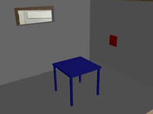

# trabalho1-computacao-grafica

> O objetivo deste trabalho é desenvolver um ambiente de realidade aumentada que simule a colocação de objetos virtuais em uma sala real. Este objetos virtuais devem representar móveis e objetos de decoração, como quadros, luminárias ou vasos.

### Configuração de Ambiente

Artoolkit (https://artoolkit.org/)

OpenGL (https://www.opengl.org/)

### Resultados alcançados:

